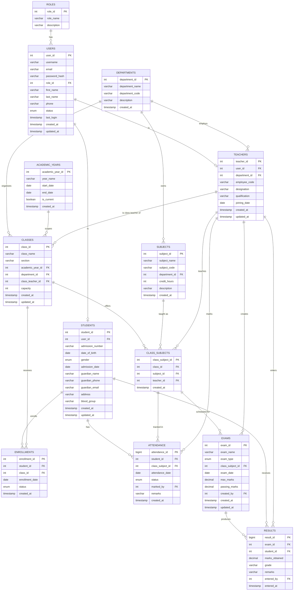

# School Management System — Database Design

## 1. Design Principles

- **Engine:** MySQL 8.x, InnoDB, `utf8mb4`
- **Normalization target:** 3NF (every non-key attribute depends on the whole key, and nothing but the key)
- **Surrogate keys:** every table uses an `INT` (or `BIGINT` for high-volume tables) auto-increment PK; natural/business keys (email, admission number, employee code, subject code) are enforced with `UNIQUE` constraints instead of being used as PKs, so they can change without breaking relationships.
- **No role-specific nullable columns on `users`:** Admin/Teacher/Student-specific attributes live in their own tables (`teachers`, `students`), linked 1:1 to `users`. This avoids a wide `users` table full of NULLs and avoids partial dependencies.
- **No derivable/redundant columns:** e.g. a student's *current class* is not stored as a column on `students` — it's derived from `enrollments` (the row with `status = 'ACTIVE'`). Storing it directly would create a transitive dependency and a data-consistency risk (two sources of truth). Likewise, `enrollments` and `exams` do not store `academic_year_id` directly because it's reachable via `classes.academic_year_id` — storing it again would violate 3NF (transitive dependency through a non-key attribute).

## 2. Entity List

| Table | Purpose |
|---|---|
| `roles` | Lookup table for ADMIN / TEACHER / STUDENT |
| `users` | Authentication + common profile data for every person in the system |
| `departments` | Academic departments |
| `teachers` | Teacher-specific profile, 1:1 with `users` |
| `academic_years` | e.g. "2025-2026", used to scope classes |
| `classes` | A class/section offered in a given academic year (e.g. "Grade 10 - A, 2025-2026") |
| `subjects` | Catalog of subjects offered by a department |
| `class_subjects` | Junction: which subject is taught in which class, by which teacher |
| `students` | Student-specific profile, 1:1 with `users` |
| `enrollments` | Junction: which student is enrolled in which class (history-preserving) |
| `attendance` | Per-student, per-class-subject, per-date attendance record |
| `exams` | An exam instance for a given `class_subjects` offering |
| `results` | A student's marks for a given exam |

## 3. ERD



## 4. Relational Schema (compact notation)

```
roles(role_id PK, role_name UNIQUE, description)

users(user_id PK, username UNIQUE, email UNIQUE, password_hash,
      role_id FK -> roles, first_name, last_name, phone,
      status, last_login, created_at, updated_at)

departments(department_id PK, department_name UNIQUE, department_code UNIQUE,
            description, created_at)

teachers(teacher_id PK, user_id FK -> users UNIQUE,
         department_id FK -> departments, employee_code UNIQUE,
         designation, qualification, joining_date, created_at, updated_at)

academic_years(academic_year_id PK, year_name UNIQUE, start_date, end_date,
                is_current, created_at)

classes(class_id PK, class_name, section, academic_year_id FK -> academic_years,
        department_id FK -> departments (nullable), class_teacher_id FK -> teachers (nullable),
        capacity, created_at, updated_at)
        UNIQUE(class_name, section, academic_year_id)

subjects(subject_id PK, subject_name, subject_code UNIQUE,
         department_id FK -> departments, credit_hours, description, created_at)

class_subjects(class_subject_id PK, class_id FK -> classes,
               subject_id FK -> subjects, teacher_id FK -> teachers, created_at)
               UNIQUE(class_id, subject_id)

students(student_id PK, user_id FK -> users UNIQUE, admission_number UNIQUE,
         date_of_birth, gender, admission_date, guardian_name, guardian_phone,
         guardian_email, address, blood_group, created_at, updated_at)

enrollments(enrollment_id PK, student_id FK -> students, class_id FK -> classes,
            enrollment_date, status, created_at)
            UNIQUE(student_id, class_id)

attendance(attendance_id PK, student_id FK -> students,
           class_subject_id FK -> class_subjects, attendance_date, status,
           marked_by FK -> teachers (nullable), remarks, created_at)
           UNIQUE(student_id, class_subject_id, attendance_date)

exams(exam_id PK, exam_name, exam_type, class_subject_id FK -> class_subjects,
      exam_date, max_marks, passing_marks, created_by FK -> teachers (nullable),
      created_at, updated_at)

results(result_id PK, exam_id FK -> exams, student_id FK -> students,
        marks_obtained, grade, remarks, entered_by FK -> teachers (nullable),
        entered_at)
        UNIQUE(exam_id, student_id)
```

## 5. Normalization Notes (why this is 3NF)

- **1NF:** every column holds a single atomic value; no repeating groups (e.g. a student's subjects aren't a comma-separated list — they come through `enrollments` → `class_subjects`).
- **2NF:** every table has a single-column surrogate PK, so there are no composite-key partial dependencies to worry about. Business-key uniqueness (e.g. `(class_id, subject_id)` in `class_subjects`) is enforced separately via `UNIQUE` constraints, not used as the PK.
- **3NF:** no non-key column depends on another non-key column.
  - `users.status` doesn't imply `role_name` — `role_name` lives only in `roles`.
  - `attendance` doesn't store `subject_name` or `teacher_name` — both are reachable via `class_subject_id`.
  - `results` doesn't store `max_marks` — it's reachable via `exam_id -> exams.max_marks`.
  - `enrollments`/`exams` don't store `academic_year_id` — reachable via `class_id`/`class_subject_id` → `classes.academic_year_id`.
  - `students` doesn't store `current_class_id` — derived from the active row in `enrollments`. This intentionally trades a small query-time join for eliminating a second source of truth.

## 6. Key Design Decisions

1. **`class_subjects` is the pivot for teaching assignments.** It answers "who teaches what, in which class" once, and `attendance`, `exams` both hang off it — so a teacher reassignment doesn't require touching historical attendance/exam records.
2. **`enrollments` is history-preserving.** A student has one row per class per academic year (via `class_id`, since a class already belongs to exactly one academic year), so promotions/transfers/repeats are all just new rows, never destructive updates.
3. **Admin has no dedicated profile table.** Since Admins have no extra attributes beyond what `users` already holds, a separate `admins` table would be an empty shell — `users.role_id = ADMIN` is sufficient.
4. **Soft-delete via `status` enums**, not row deletion, on `users`, `enrollments` — preserves referential/historical integrity for audit purposes (grades, attendance shouldn't vanish because a user was deactivated).
